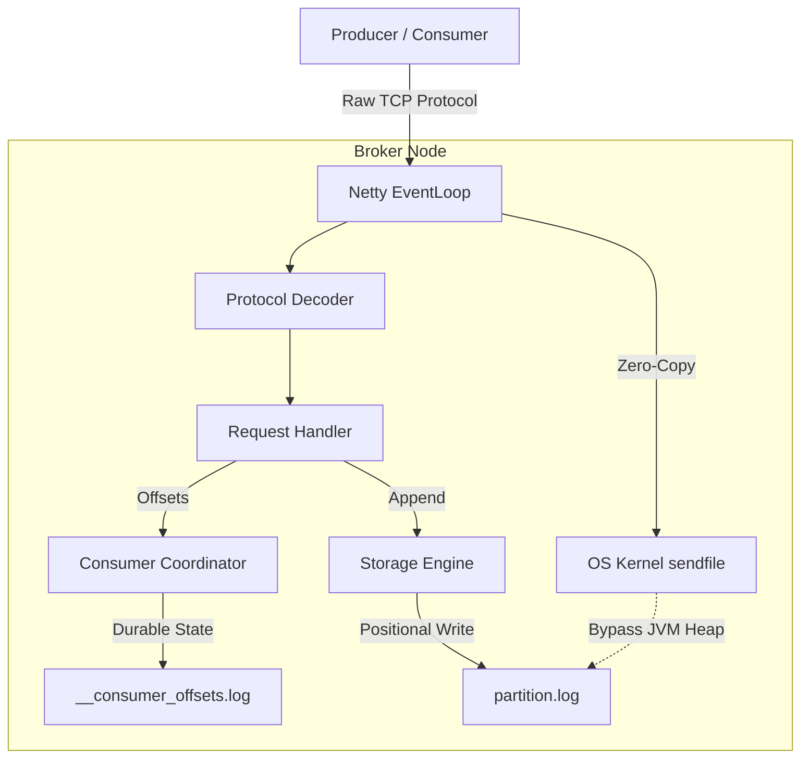

# Kafka-Lite (Distributed Message Broker)

A lightweight, high-performance distributed message broker built from scratch using **Java 21**. This project demonstrates low-level system design, disk I/O optimization, custom binary network protocols, and high-performance storage techniques without relying on heavyweight frameworks such as Spring Boot.

---

# 🏗️ Architecture

Kafka-Lite follows a **Zero-Copy** and **Zero-Allocation** design philosophy, leveraging **Java NIO**, **Netty**, and operating system optimizations to maximize throughput while minimizing memory overhead.



---

# 🚀 Features

### Custom Storage Engine

* Append-only commit log built using `FileChannel`.
* Thread-safe positional writes.
* Sequential disk I/O for high write throughput.

### O(1) Offset Resolution

* In-memory `ConcurrentSkipListMap` index.
* Fast offset-to-byte-position lookups.

### Zero-Copy Fetching

* Uses `FileChannel.transferTo()` (Linux `sendfile`) to stream data directly from disk to the network socket.
* Minimizes JVM heap allocations and unnecessary memory copies.

### Custom Binary TCP Protocol

* Length-prefixed binary protocol.
* Low serialization overhead.
* Optimized for throughput.

### Consumer Group Coordination

* Durable consumer offset tracking.
* Internal `__consumer_offsets.log` persists committed offsets.
* Consumers automatically resume from the last committed offset after broker restart.

### Docker Support

* Containerized deployment.
* Persistent volume mapping for broker logs.

---

# 🛠️ Getting Started

## Prerequisites

* Java 21+
* Maven
* Docker Desktop (running)

---

## Step 1: Build the Executable JAR

Compile the project and package all dependencies into a single executable JAR using the Maven Shade Plugin.

```bash
mvn clean package
```

The generated JAR will be available in the `target/` directory.

Example:

```text
target/kafka-lite-storage-1.0-SNAPSHOT.jar
```

---

## Step 2: Build the Docker Image

```bash
docker build -t kafka-lite .
```

---

## Step 3: Run the Broker

Start the broker, expose port **9092**, and create a persistent Docker volume for log storage.

```bash
docker run \
  -d \
  --name kafka-lite-broker \
  -p 9092:9092 \
  -v kafka-lite-data:/app/data \
  kafka-lite
```

---

## Step 4: Verify the Broker

View the broker logs:

```bash
docker logs -f kafka-lite-broker
```

Expected output:

```text
🚀 Kafka-Lite Netty Broker listening on TCP port 9092
```

---

# 💻 Running the Clients

With the broker running on `localhost:9092`, use the provided Java clients to communicate using the custom binary protocol.

---

## Producer

Run:

```text
NettyProducerClient
```

### What it does

* Connects to the broker.
* Creates a **ProduceRequest** (`API Key = 1`).
* Sends the message over the custom TCP protocol.
* Receives the assigned offset from the broker.

### Example Output

```text
Offset: 0
```

---

## Consumer

Run:

```text
NettyConsumerClient
```

### What it does

1. Retrieves the last committed offset for the `payments-service` consumer group.
2. Fetches messages using the broker's zero-copy pipeline.
3. Processes the received records.
4. Commits the updated offset back to `__consumer_offsets.log`.

### Resume Behavior

Run the consumer multiple times.

Because offsets are durably stored, the consumer resumes from the previously committed position instead of reprocessing old messages.

---

# 📁 Project Structure

```text
com.manish.kafkalite
│
├── storage
│   ├── LogSegment
│   ├── Message
│   └── Storage Engine
│
├── network
│   ├── Netty Server
│   ├── Producer Client
│   ├── Consumer Client
│   └── TCP Networking
│
├── network.protocol
│   ├── Request Encoders
│   ├── Response Decoders
│   └── Binary Protocol
│
└── coordination
    ├── Consumer Coordinator
    └── Offset Management
```

---

# ⚙️ Core Technologies

* Java 21
* Netty
* Java NIO
* FileChannel
* ConcurrentSkipListMap
* Docker
* Maven

---

# 📌 Design Highlights

* Append-only commit log architecture.
* Sequential disk writes for improved throughput.
* Zero-copy message transfer using `FileChannel.transferTo()`.
* Custom binary wire protocol.
* Persistent consumer offset management.
* Lightweight implementation with minimal dependencies.
* Container-ready deployment.

---

# 📄 License

This project is intended for educational purposes and demonstrates the internal design principles behind distributed log-based messaging systems similar to Apache Kafka.